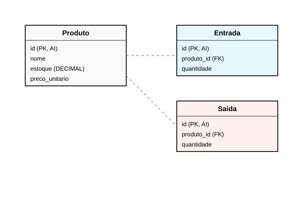

# Capítulo 01: Modelagem de Dados e Configuração do Banco

Neste capítulo, definiremos a estrutura do nosso banco de dados MariaDB e criaremos os scripts necessários para iniciar a aplicação.

## 1. Diagrama Entidade-Relacionamento (DER)

O modelo consiste em três tabelas principais: `produto`, `entrada` e `saida`.



## 2. Script DDL (Criação das Tabelas e Triggers)

Execute este script no seu cliente MariaDB (como o HeidiSQL, DBeaver ou linha de comando).

```sql
CREATE DATABASE IF NOT EXISTS estoque;
USE estoque;

-- Tabela de Produtos
CREATE TABLE produto (
    id INT AUTO_INCREMENT PRIMARY KEY,
    categoria ENUM('Eletrônicos', 'Periféricos', 'Componentes', 'Outros') NOT NULL,
    nome VARCHAR(100) NOT NULL,
    descricao TEXT,
    preco_unitario DECIMAL(10, 2) NOT NULL,
    unidade_medida VARCHAR(20) DEFAULT 'UN',
    estoque DECIMAL(10, 3) DEFAULT 0.000,
    ativo BOOLEAN DEFAULT TRUE
);

-- Tabela de Entradas
CREATE TABLE entrada (
    id INT AUTO_INCREMENT PRIMARY KEY,
    data DATE NOT NULL,
    produto_id INT NOT NULL,
    quantidade DECIMAL(10, 3) NOT NULL,
    preco_unitario DECIMAL(10, 2) NOT NULL,
    FOREIGN KEY (produto_id) REFERENCES produto(id)
);

-- Tabela de Saídas
CREATE TABLE saida (
    id INT AUTO_INCREMENT PRIMARY KEY,
    data DATE NOT NULL,
    produto_id INT NOT NULL,
    quantidade DECIMAL(10, 3) NOT NULL,
    preco_unitario DECIMAL(10, 2) NOT NULL,
    FOREIGN KEY (produto_id) REFERENCES produto(id)
);

-- Trigger 1: Aumentar estoque ao registrar Entrada
DELIMITER //
CREATE TRIGGER tg_aumenta_estoque
AFTER INSERT ON entrada
FOR EACH ROW
BEGIN
    UPDATE produto 
    SET estoque = estoque + NEW.quantidade 
    WHERE id = NEW.produto_id;
END //
DELIMITER ;

-- Trigger 2: Diminuir estoque ao registrar Saída
DELIMITER //
CREATE TRIGGER tg_diminui_estoque
AFTER INSERT ON saida
FOR EACH ROW
BEGIN
    UPDATE produto 
    SET estoque = estoque - NEW.quantidade 
    WHERE id = NEW.produto_id;
END //
DELIMITER ;

-- Trigger 3: Validar estoque antes da Saída (Evitar negativo)
DELIMITER //
CREATE TRIGGER tg_valida_estoque_saida
BEFORE INSERT ON saida
FOR EACH ROW
BEGIN
    DECLARE estoque_atual DECIMAL(10,3);
    SELECT estoque INTO estoque_atual FROM produto WHERE id = NEW.produto_id;
    
    IF estoque_atual < NEW.quantidade THEN
        SIGNAL SQLSTATE '45000' 
        SET MESSAGE_TEXT = 'Estoque insuficiente para esta saída!';
    END IF;
END //
DELIMITER ;

-- Trigger 4: Copiar preço atual do produto para a Saída
DELIMITER //
CREATE TRIGGER tg_copia_preco_saida
BEFORE INSERT ON saida
FOR EACH ROW
BEGIN
    SELECT preco_unitario INTO NEW.preco_unitario 
    FROM produto WHERE id = NEW.produto_id;
END //
DELIMITER ;
```

## 3. Script DML (Dados de Teste)

Vamos popular o banco com 10 produtos e algumas movimentações iniciais.

```sql
-- Inserção de Produtos
INSERT INTO produto (categoria, nome, descricao, preco_unitario, unidade_medida, estoque, ativo) VALUES
('Eletrônicos', 'Mouse Wireless', 'Mouse sem fio ergonômico', 45.90, 'UN', 0, TRUE),
('Eletrônicos', 'Teclado Mecânico', 'Teclado switch blue', 180.00, 'UN', 0, TRUE),
('Periféricos', 'Monitor 24pol', 'Full HD IPS', 890.00, 'UN', 0, TRUE),
('Componentes', 'SSD 480GB', 'Leitura 500MB/s', 220.50, 'UN', 0, TRUE),
('Componentes', 'Memória RAM 8GB', 'DDR4 2666MHz', 150.00, 'UN', 0, TRUE),
('Eletrônicos', 'Webcam HD', 'Com microfone integrado', 120.00, 'UN', 0, TRUE),
('Periféricos', 'Headset Gamer', 'Surround 7.1', 250.00, 'UN', 0, TRUE),
('Componentes', 'Fonte 500W', 'Certificação 80 Plus', 300.00, 'UN', 0, TRUE),
('Outros', 'Cabo HDMI 2m', 'Alta velocidade', 25.00, 'UN', 0, TRUE),
('Outros', 'Suporte Monitor', 'Ajustável em altura', 85.00, 'UN', 0, TRUE);

-- Inserção de Entradas (Abastecimento inicial)
INSERT INTO entrada (data, produto_id, quantidade, preco_unitario) VALUES
('2023-10-01', 1, 50.000, 40.00),
('2023-10-01', 2, 20.000, 150.00),
('2023-10-02', 3, 10.000, 800.00),
('2023-10-02', 4, 30.000, 200.00),
('2023-10-03', 5, 40.000, 130.00),
('2023-10-03', 6, 15.000, 100.00),
('2023-10-04', 7, 10.000, 220.00),
('2023-10-04', 8, 15.000, 280.00),
('2023-10-05', 9, 100.000, 15.00),
('2023-10-05', 10, 20.000, 70.00);

-- Inserção de Saídas (Vendas iniciais)
INSERT INTO saida (data, produto_id, quantidade, preco_unitario) VALUES
('2023-10-10', 1, 5.000, 45.90),
('2023-10-11', 2, 2.000, 180.00),
('2023-10-12', 4, 10.000, 220.50),
('2023-10-13', 5, 8.000, 150.00),
('2023-10-14', 9, 20.000, 25.00);
```

## 4. Próximo Passo

No próximo capítulo, configuraremos o projeto no VS Code usando Maven e criaremos a classe de conexão com o banco de dados.